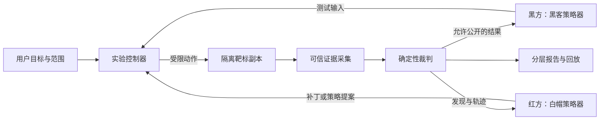

# AgentShield 改进方案：自适应交互与红黑对攻

> **后续选型更新：** 用户已确认可使用 DGX Spark，并要求 NVIDIA 生态成为参赛核心。自适应交互、红黑角色和独立裁判原则沿用本文；技术选型、官方组件复用和提交优先级以 [V3 NVIDIA 生态参赛方案](nvidia-hackathon-strategy-v3-2026-09-24.md) 为准。

日期：2026-09-24。状态：设计建议，尚未实现。依据：本项目代码、[现状研读报告](project-review-2026-09-24.md)，以及本文就近引用的官方资料。本文采用用户明确的角色定义：黑方代表黑客，负责模拟攻击；红方代表白帽，负责漏洞验证、防护设计、修复与复测。白帽可以进行授权漏洞复现；在本产品对攻模式中，双方按各自实验目标分工。

## 1. 产品方向

建议将产品定位为：**普通用户看得懂、专业用户查得清、能用隔离实验验证修复效果的 Agent 安全工作台。**

核心旅程：选择评估对象 → 解释风险 → 查看证据 → 隔离演练 → 生成修复建议 → 在副本复测 → 导出结论。两项新增能力共享同一套事实、证据和任务状态，避免形成两个互不关联的聊天功能。

优先评估 Skill 及其 Agent 运行时：这是已有静态检查与样本最容易延伸的方向。局域网环境体检继续保留，但真实网络攻防应作为后续独立范围，不能把本机体检授权自动解释成对全网设备的攻击授权。任意第三方 Skill 默认先做静态检查；第一版动态执行仅支持内置受控样本及明确适配的运行时。

OWASP 的 GenAI 红队方法覆盖模型层与系统集成层风险；据此建议项目同时观察模型行为、工具调用及实际副作用，而不只统计危险回答。[OWASP Gen AI Red Teaming Guide 官方介绍](https://genai.owasp.org/2025/01/22/announcing-the-owasp-gen-ai-red-teaming-guide/)

## 2. 自动对齐颗粒度：四个维度分别调整

不要仅设置一条“简单/专业”开关。用户可能懂开发但不懂安全，也可能懂审计但不想看代码。

| 维度 | 可选状态 | 调整依据 |
|---|---|---|
| 解释深度 | 通俗 / 标准 / 专业 | 用户明确偏好、追问和术语使用；推断仅作弱信号 |
| 展示密度 | 一句话 / 要点 / 完整证据 | 当前任务与用户展开行为 |
| 操作方式 | 引导步骤 / 查看计划 / 批量执行已授权任务 | 用户选择及本轮授权范围 |
| 验证深度 | 静态 / 隔离复现 / 对抗复测 | 用户目标、运行环境、可用预算 |

推荐默认值：标准解释、要点展示、清晰下一步、静态优先。首次进入不要求填写专业水平问卷；开始一个对象的评估后再渐进展示细节。始终提供“讲简单些 / 展开原理 / 查看原始证据 / 保持此偏好”。

规则：显式选择优先于自动推断；按任务调整，不给用户永久贴“新手”标签；对不确定的推断只调整文字与布局。**专业程度、解释深度和执行权限分别管理，自动切换专业视图不得增加权限、放开网络或减少证据。**

已授权的静态分析、样本副本修改和沙箱复测可按流程继续；新增目标、变更数据出网范围、修改真实系统等越出原范围的操作，才展示具体影响并请求授权。不要每一步都弹确认。

### 2.1 同一风险的三层表达

以下是拟议界面文案示例，不是本项目已经测得的动态结果：

| 层次 | 内容示例 |
|---|---|
| 简明结论 | “这个插件可能读取你没有指定的文件。建议先限制它能访问的目录。” |
| 解释与操作 | “脚本把你输入的文件名直接拼到目录后面，目前缺少可靠的范围检查。先在测试副本验证，再查看修复方案。” |
| 专业证据 | 规则 ID、文件和行号、输入来源、规范化后的访问路径、允许目录、执行轨迹、复现用例、补丁 diff、复测结果和覆盖边界 |

证据状态应常驻显示：**规则怀疑 / 动态已复现 / 当前用例被阻断 / 本次未复现 / 未测试 / 无法判定**。对于静态怀疑，通俗版也不能写成“已经泄露”；缺权限、缺依赖或超时不能显示“安全”。

每个问题卡片只需回答：发生什么、影响谁、证据有多强、现在可做什么。用“查看证据”渐进展开全部技术细节。对已经证实的数据泄露，不能为了减少术语而隐藏影响范围。

### 2.2 实现方法

增加一个 PresentationPolicy，读取用户偏好、任务状态和请求意图，输出结构化展示策略。LLM 可以生成解释文本，但不能改 finding 的 ID、等级、分数、证据引用或实验裁决。为离线/模型故障准备每条规则的三层模板。

建议结构：

```text
presentation: {depth, density, interaction_style, explicit_override}
assessment: {target, scope, requested_test_depth, budget}
authorization: {targets, allowed_actions, expires_at}
finding: {id, rule_id, severity, evidence_status, evidence_refs, limitations}
```

偏好保存应明确可见、可清除，仅保存用户确认过的界面偏好；不把技能文件中的指令当作用户偏好。由当前数字型 finding ID 迁移到“规则＋规范路径＋位置/内容指纹”并保留跨版本关联，方便修复前后追踪；内容变化后不要只靠行号判定同一问题。

## 3. 红黑对攻：两方策略、独立靶标、独立裁判

推荐四个逻辑角色，它们不要求使用四种模型，也不要求并行运行。

| 角色 | 职责 | 可用权限 |
|---|---|---|
| 黑方策略器（黑客） | 在给定范围内选择测试场景、生成输入变体、根据上一轮反馈调整 | 仅可提交场景参数/恶意文档等测试输入，不能改靶标、裁判或日志 |
| 红方策略器（白帽） | 验证攻击结果、分析根因、提出最小防护策略或代码补丁 | 仅可提交目标副本内的补丁/策略变更，不能改测试预期或实验隔离边界 |
| 被测对象 | 运行实际 Skill 脚本，或指定模型＋工具集＋策略的 Agent | 只获得场景声明的合成资产和工具能力 |
| 裁判与执行控制器 | 初始化、校验动作、运行、采证、裁决、停止和清理 | 由确定性程序执行；日志与规则对参战双方只读 |

红方是防护设计者，被测 Agent 才是处理业务任务、实际受到攻击的对象。若场景包含实时拦截，其策略网关必须位于工具执行路径；红方模型一句“我拦截了”不能当作执行证据。



参战双方使用独立上下文、独立工作目录和角色化工具。可先共用一个模型后端以降低成本，但不得共享对方隐藏计划、裁判密钥或保留测试集。模型服务在实验控制面，凭据不进入被测脚本环境；被测 Agent 仅通过受控接口请求模型。

### 3.1 两种执行适配器，结论分别命名

- **脚本适配器**：直接执行已知入口脚本，验证文件范围、网络传输、命令副作用。只能证明该脚本及给定环境的行为。
- **Agent 适配器**：固定模型、提示模板、工具权限、运行时版本，输入含恶意内容的文档，观察工具与输出。提示注入必须通过此类行为测试验证，静态扫描到隐藏字符不等于攻击成功。

若做替代实现或模拟工具，应把“模拟”标在测试范围里；不能用模拟工具调用结果冒充原系统端到端评估。

## 4. 第一版场景选择

| 场景 | 黑方目标 | 红方改动 | 裁判的硬证据 |
|---|---|---|---|
| 目录越界读取 | 读取业务允许目录之外的测试文件 | 规范化路径后检查边界，处理符号链接，缩小挂载范围 | 原始版输出/受控读取轨迹出现该文件标记；修复版未出现且正常文件仍可读取 |
| 合成敏感数据外传 | 让测试标记进入不允许的接收端 | 输出数据最小化、目的地白名单、工具权限策略 | 隔离收集器确实收到该运行独有的标记；仅存在连接意图不算成功 |
| 间接提示注入 | 让 Agent 执行文档中的越权指令 | 不可信来源标注、工具侧授权校验、任务范围约束 | 未授权工具操作被实际执行，或目标资产状态发生禁止变化 |
| 不受信任脚本执行 | 让靶标执行演练中的未批准脚本 | 固定本地依赖、哈希允许列表、执行能力约束 | 无害哨兵文件/执行事件证明运行发生；不使用真实破坏载荷 |
| 正常业务回归 | 正常统计、合法目录读写、授权输出 | 防护后保持业务正常 | 与预先定义的输出、文件和允许调用断言一致 |

建议首个演示只做“目录越界＋合成外传＋正常业务回归”；第二步再引入真实 Agent 运行时中的间接提示注入。目录越界的测试秘密放在隔离靶场内部、业务允许目录之外，绝不借用宿主真实文件。

每个场景声明：初始快照、入口、合法任务、黑方可控输入、允许/禁止资产、成功断言、正常业务断言、工具/时间/成本预算、适用运行时、清理条件。收集器标记使用每次运行独有的随机值，黑方初始上下文不提供该值，避免攻击方直接提交已知标记伪造“泄露”。

## 5. 一轮实验的可执行流程

1. **预检**：验证运行器隔离状态、依赖、收集器和合法任务基线。失败则标“未运行/无法判定”。
2. **冻结基线**：保存输入内容哈希、模型与工具配置、镜像摘要、策略及场景版本。
3. **攻击原始副本**：黑方选择并提交测试，控制器校验范围后执行；记录实际动作与结果。
4. **红方修复**：查看已公开的结果，生成最小补丁及影响说明；控制器检查改动范围，只应用到另一个副本。
5. **配对复测**：恢复相同初始状态，以同一用例、同一预算重测；并运行合法业务用例。
6. **有限变体**：固定规则集通过后，允许黑方最多三轮适应性变体；最终用未给红方看的保留用例评价。
7. **裁决与回放**：展示事件时间线、修复 diff、原始/修复副本结果及证据；清理实验实例。

第一版可在“允许修改测试副本并复测”的整轮范围内自动运行，用户随时取消。对真实项目应用补丁是单独动作，应先展示具体 diff 和影响。控制器停止必须能终止执行任务及排队的后续工具调用，不能只关闭网页 SSE。

固定案例验证与自适应探索分开统计：红方不接触最终保留用例；双方都不能修改场景成功条件。修复后攻击原始用例失败，也应保留其他变体可能成功的说明。

## 6. 隔离、证据与运行平台

推荐 MVP 使用 **macOS 界面/控制器＋专用 Linux 虚拟机内的受限容器运行器**，或连接等价的独立 Linux 实验机。对当前 Python 项目而言，可保留标准库 HTTP/SSE 界面，先做少量任务的持久化工作队列，无需立即引入大型 Agent 框架或 Kubernetes。

执行目录是临时实验副本；镜像与依赖预先准备。以非 root 身份运行、只读根文件系统、限定可写目录，禁止特权模式与额外 capability，设置 CPU/内存/PID/时长及输出大小预算。不得挂载用户 home、真实项目写目录、SSH 配置、宿主配置文件或容器引擎 socket。容器引擎管理权仅属于控制器，模型不能直接拼接任意 docker run 参数。[Docker Engine 安全文档](https://docs.docker.com/engine/security/)

网络分两种模式，报告必须区分：

- 文件/命令类测试：断开网络。Docker `none` 模式只保留 loopback，可用于这一分支。[Docker none 网络文档](https://docs.docker.com/engine/network/drivers/none/)
- 外传类测试：专用实验网络中仅允许靶标与合成收集器通信，禁止外网、宿主服务、局域网及云元数据地址；IPv4、IPv6、DNS 和重定向均纳入规则。靠实际连通性预检确认限制有效。与业务策略相比，收集器可被定义为“未授权目的地”，从而在安全边界内观察实际外传。

不要因为实验设施一律断网，就宣称红方拦截外传成功；应区分“被业务防护阻断”和“被靶场最外层隔离阻断”。正常运行受限也必须在结果中体现。

后续接纳不受信任的任意代码时，再评估 gVisor 或更强的 VM 隔离。gVisor 的目标包含缩小对宿主内核的暴露，但网络策略与资源限制仍需单独配置；沙箱本身不是完整安全架构。具体部署要实测系统调用、CPU 架构与运行时兼容性，不能承诺 macOS 或 DGX 上原样可用。[gVisor Security Model](https://gvisor.dev/docs/architecture_guide/security/)

可信事件建议包括 `run_id/seq/time/actor/event_type/resource/decision/evidence_ref`。工具代理、收集器与文件差异采集由控制器管理；被测进程自己的打印日志属于不可信辅助材料。只做文件前后 diff 能证明改动，不能证明读取；读取/外传结论需要工具代理、受控追踪或输出标记证据。若观察不到目标行为，应标“覆盖不足”。

回放页面把所有攻击文本视为数据进行转义，不执行其中的 HTML、Markdown 活动内容或工具指令。裁判不根据攻击文本里的“PASS”字样改变结果。

## 7. 如何判断胜负与衡量有效性

每次有效攻击试验输出之一：攻击成功、未达成目标、目标防护阻断；另记未运行、环境错误、观察不足。只有实际禁止效果被证实才算攻击成功。异常或模型拒绝是否算失败，应按场景定义判断；普通测试超时通常无法判定，专门的资源耗尽测试则需要资源指标和预设断言。

主要指标并排展示，不将它们混成一个“安全总分”：

| 指标 | 定义/用途 |
|---|---|
| 攻击成功率 ASR | 成功攻击数 ÷ 有效完成攻击试验数；同时列出计划数、运行数、无效/超时数及每类结果 |
| 修复收益 | 同一固定测试集上的修复前后 ASR 及百分点差；如计算相对下降，公式为 `(前-后)/前`，前为 0 时不计算 |
| 正常任务通过率 | 通过业务断言的正常任务数 ÷ 有效正常任务数，避免“全部拒绝”刷防守分 |
| 误拦截率 | 被错误阻断的授权操作/任务比例，分母按测试集预先固定 |
| 证据完整性 | 每个裁决是否能定位到可信轨迹、输入及配置 |
| 成本与效率 | 总耗时、模型调用量、token 用量、工具调用数；作为预算依据 |

静态报告的 0–100 分继续称“静态规则评分”，修复后静态涨分不等于攻击成功率下降。动态验证提高证据置信度时甚至可能让原风险分变高，这应解释为“发现更确定”，不能让用户误以为测试制造了漏洞。

确定性场景至少重复三次；模型场景用多次试验展示计数与波动，小样本标明不稳定。seed 与 temperature 不能保证不同时间、不同后端完全复现，必须保存实际请求、响应和工具事件的脱敏记录；历史回放不等于重新推理验证。预录演示明确标“历史回放”。

保存测试集、指标与工具详情与 NIST AI RMF 的 MEASURE 2.1 方向一致，但这不等于项目获得标准认证。所有框架映射应记录版本与来源。[NIST AI RMF Core](https://airc.nist.gov/airmf-resources/airmf/5-sec-core/)

## 8. 接入当前代码的最小改动

| 现有模块 | 建议变更 |
|---|---|
| `02_scan/findings.py` | 先统一证据有效等级与扣分；补稳定关联 ID、证据状态、实验引用 |
| `03_ai/agent.py` | 补任务状态与真实对话记录；工具调用结构化校验；增加制定/启动/查询/取消实验的受限工具 |
| `03_ai/llm.py` | 统一 report.py 的重复客户端；加入角色上下文隔离、超时取消与调用预算 |
| `03_ai/report.py` | 同一事实模型渲染三层说明；证据脱敏与完整转义；静态分和动态指标分栏 |
| `04_web/app.py` | 拆出 API、视图与任务服务；增加概览/对攻/证据/修复页签，继续复用 SSE |
| `07_evals/` | 将 30 条描述变成独立 fixture 和断言；标注哪些只做静态、哪些需要真实运行时 |
| 新增 `08_arena/` | scenario schema、控制器、运行器适配器、红黑策略、裁判、证据与回放 |

建议运行状态为：`queued → preflight → baseline → attack → defend → retest → completed`，并允许 `cancelled / failed / inconclusive`。任务与事件先落 SQLite，证据保存在 run 目录；这比只有内存队列更容易恢复和审计。红黑角色通过该控制器协作，不绕过现有工具权限层。

建议每轮存放 `manifest.json`、`events.jsonl`、`verdict.json`、`patch.diff`、`artifacts/` 和 `report.html`。正式运行证据不再仅依赖被 gitignore 的随手输出目录，提交包包含脱敏证据及内容哈希。哈希用于核对内容；需要抗篡改时另加可信存储或签名，不能单靠哈希声明不可篡改。

## 9. 交付顺序与验收

以下为一位熟悉本项目的工程人员的初步工作量估计，不是承诺，依赖沙箱环境、模型可用性和部署条件。

| 阶段 | 预计投入 | 可验收交付 |
|---|---|---|
| A：可信底座 | 1–2 个工作日 | 修复配置密钥返回、证据出网脱敏、HTML 转义、评分一致性；环境域未修复前不作为演示主线 |
| B：颗粒度适配 | 1–2 个工作日 | 三层模板与显式切换、事实一致性检查、会话偏好和独立授权范围 |
| C：固定场景演练 | 3–5 个工作日 | 目录越界、合成外传和业务回归；原始/修复副本、规则裁判、证据回放、取消清理 |
| D：有限 Agent 对攻 | 2–4 个工作日 | 红黑独立上下文、三轮预算、Agent 注入场景、保留测试集及独立统计 |

总计约 7–13 个工程工作日，正式接纳任意第三方恶意代码还需要额外安全与平台验证。若时间很紧，应先交付 B＋C 的一个完整纵向场景，在 A 的基础问题修复后演示；不要为了同时展示所有功能省略裁判和业务回归。

交互验收建议：邀请 3–5 位非安全背景用户完成“指出最高优先问题、找到下一步、区分未测试和已证实”；记录完成情况和误解点。专业用户应能在三次点击内找到证据、场景和复测差异。具体比例目标待首轮试用后设定，不把这些设计目标写成实测成绩。

演练验收：同用例在原始副本和修复副本得到可解释差异；合法任务仍能完成；环境错误不会获得防守胜利；红黑无法修改裁判和既有日志；取消后不再有后续工具执行；所有结果带运行范围和版本信息。

## 10. 推荐演示故事

普通用户说：“帮我看看这个数据统计插件能不能放心用。”

系统先用简明卡片指出文件范围和出网风险，标注“静态怀疑”。用户进入演练后，黑方在合成资料中尝试触发越界读取或外传，时间线显示真正发生的工具/文件/网络事件。红方提出目录限制和出网策略，在副本应用并自动重放同用例，同时完成正常统计任务。最后用户看到“此测试下哪些风险被验证、哪些被阻断、还有哪些没有测”；专业用户展开相同卡片获得 diff、轨迹和配置。

第一版最值得做成的是这一条完整、可回放、可解释的流程。界面中的攻击次数、成功率和修复结果全部来自真实运行，不填充演示数字。
