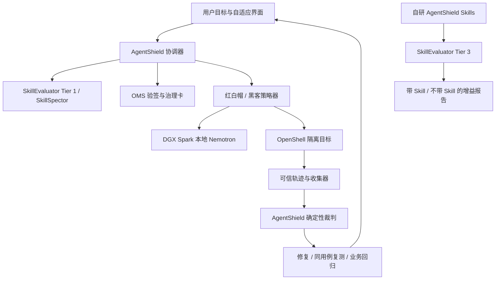

# AgentShield V3：以 NVIDIA 生态为核心的黑客松参赛方案

日期：2026-09-24。状态更新：当前没有 DGX Spark，已接通私有 Qwen3.8-27B；已实现公共 Wi-Fi 规则仿真及原版 NVIDIA SkillSpector 2.12.0 接入。各模式实测结果见 [NVIDIA 集成验收](nvidia-integration-2026-09-24.md)，演练见 [当前演练实现](public-wifi-arena-2026-09-24.md)。Spark、OpenShell、来源验签与 Tier 3 仍为计划，下文未单独标明完成的部分均为设计。

已确认约束：用户明确 NVIDIA 生态是参赛核心评分方向，最新澄清目前手头没有 DGX Spark，先使用已部署私有模型；黑方＝黑客，红方＝白帽。本文将这些要求作为设计优先级。旧文档内的“NVIDIA/DGX 15%”是历史内部估计，不再用来决定资源投入，也不代表官方评分权重。本次没有获得完整官方评分表，不虚构新百分比。

## 1. 建议确立的参赛主张

**AgentShield：面向 NVIDIA Agent Skills 生态的安全验证与红黑演练工作台，先用私有模型开发，后续在设备可用时迁移 DGX Spark。**

用户价值：开发者或普通使用者在启用一个 Skill 前，能了解来源与风险；在给定工具权限和本地模型下观察风险是否会实际触发；由白帽提出修复，再以相同测试验证安全性及正常功能，最后得到适合自己阅读深度的证据报告。

获奖竞争力应来自可验证的结合：

1. NVIDIA Skills 体系提供能力包、信任记录与标准化评测入口。
2. NVIDIA 软件承担扫描、评测或执行边界中的实际职责。
3. 当前私有 Qwen 支持开发与红黑复盘；后续 DGX Spark / Nemotron 承担本地推理并提供独立实测证据。
4. AgentShield 的新增价值是把这些能力组织为面向具体部署环境的攻击—修复—复测流程，增加确定性安全断言、业务回归和自适应交互。

这是竞争策略，不是获奖保证。验收时按集成日志和实验结果核对，不能用安装记录代替有效使用证据。

## 2. 研读 NVIDIA/skills 后需要调整的方向

`NVIDIA/skills` 是可移植技能的目录及分发入口，技能由所属产品仓库维护并同步，不是一个开箱即用的通用多智能体运行框架。集成时应区分“使用官方 Skill 指导工作”和“调用对应 NVIDIA 软件运行能力”。[官方仓库](https://github.com/NVIDIA/skills)

官方现有信任体系已经包含：SkillEvaluator 的 Tier 1 校验及 SkillSpector 扫描、Tier 2 语义去重、Tier 3 真实 Agent 的带/不带 Skill 对照，以及治理卡和签名。因此不能把“有安全扫描”或“能动态执行 Skill”单独作为原创点。[NVIDIA Trust Pipeline](https://docs.nvidia.com/skills/agent-skill-trust-pipeline)

建议把现有正则引擎降为轻量补充/离线回归基线，以官方扫描结果为主要外部输入；保留自己的 Finding 契约、证据裁判和用户界面。对外表述为“基于 NVIDIA 开源能力的场景化扩展”，清楚列明上游能力与自己的贡献。

## 3. 主技术栈：四个核心支柱

| 核心组件 | 在 AgentShield 中的职责 | 评委可核验的证据 |
|---|---|---|
| DGX Spark＋NVIDIA Nemotron | 本地语义评估、黑方输入变体、红方根因/修复建议、三层解释 | 实际模型 ID/权重 revision、设备信息、服务请求记录、延迟/吞吐/内存、断外网运行记录 |
| NVIDIA SkillEvaluator / SkillSpector | 接入官方质量安全校验；评测自研 AgentShield Skill 是否提升任务表现 | 原始结果 JSON、版本、范围、带/不带 Skill 对照及失败记录 |
| NVIDIA OpenShell | 在演练中施加文件、进程、网络等执行约束，记录策略阻断 | 有效策略、沙箱 ID、allow/deny 事件、前后版本及受控接收端证据 |
| NVIDIA Skills 治理资产 | 读取 Skill Card、执行来源验签；用官方生成器制作自研技能的治理卡草稿 | 上游固定版本、验签结果、生成器运行记录、经核对的治理卡、许可证归属 |

这四项是拟实施的职责，不表示当前项目已经完成集成。

### 3.1 当前私有 Qwen；后续 DGX Spark / Nemotron

当前开发使用用户私有 Qwen3.8-27B 的兼容 API，已通过模型列表、JSON、SSE 与原生工具调用响应格式四项合成测试。原生工具响应通过不代表现有文本 ReAct 已迁移；不将 Qwen 推理算作 NVIDIA 技术集成，也不将私有局域网服务称为完全离线。当前优先推进 NVIDIA 软件评测与治理接入，设备到位后单独验收硬件迁移。

NVIDIA 官方有在单台 DGX Spark 以 vLLM 运行 Nemotron 3 Nano 的部署 playbook。当前所读页面具体示例使用 Nano Omni；不能把它的启动参数未经验证地套到任意同名模型。设备可用后，建议先选官方路径能在目标机器成功部署的 Nano 权重，固定 revision 和容器摘要，通过中文解释、工具调用及结构化输出三类小测试后锁定。[Nemotron on DGX Spark](https://build.nvidia.com/playbooks/nemotron/instructions-nano)

第一版用一套模型服务承载三套独立上下文：黑方、红方、讲解员，按队列调度；不同时加载多套大模型。模型服务是可信控制面，被测脚本不能读模型目录、凭据或管理接口。场景脚本不需要 GPU 访问，GPU 仅交给推理服务。

vLLM 本身是开源推理服务，参赛归属应准确写成“在 DGX Spark 上部署 NVIDIA Nemotron，通过 vLLM 提供推理”。不把第三方组件全部称为 NVIDIA 自研。NIM 可在后续有对应模型、许可和 ARM64 profile 的实测基础上替换，不强加为首版依赖。

“本地”验收覆盖所有调用：AgentShield、扫描器语义后端、评测用 Agent、评测用 grader 都要检查。仅把网页对话改为本地，不足以声称整套评测离线。

### 3.2 SkillEvaluator / SkillSpector：复用并保留证据边界

SkillSpector 已提供静态及可选模型分析，支持通用兼容端点、结构化结果与集成退出码。其静态模式仍可能查询 OSV 的依赖漏洞数据；`--no-llm` 不等于绝不出网。配置本地模型后，还要单独约束漏洞查询及其他服务。[SkillSpector 仓库](https://github.com/NVIDIA/SkillSpector)

接入方案：

- 新增结果适配器，保存引擎、版本、原始 finding ID、扫描范围、原始严重度及证据引用；规则分和模型推断信号分栏。
- 官方输出如果含 LLM 推断，明确标“模型线索”，不伪装成 AgentShield 确定性规则。LLM 不直接改已验证分数；晋升为已复现发现须由运行证据支撑。
- 不用进程退出 0 简化成“绝对安全”，必须读取实际 finding、覆盖状态和错误。
- 完整 SkillEvaluator Tier 1 运行已经包含扫描，不再重复执行 SkillSpector 并把两份报告算成两次独立验证。对日常“只扫目录”可另设轻量入口。

SkillEvaluator Tier 3 用于评价我们交付的 AgentShield Skill：同模型、同工具与同任务，比较有无该 Skill 的行为差异；这是“技能增益”实验。[Tier 3 Live Evaluation](https://docs.nvidia.com/skills/skillevaluator/tier3-live-evaluation)

### 3.3 OpenShell：使红方防护有执行位置

OpenShell 的文件系统与进程约束在创建沙箱时确定，网络策略可运行时更新。红方生成文件权限方案后，控制器应新建目标副本复测；不能假定所有防护都能热更新。工具代理与可信收集器提供裁决证据，OpenShell 日志提供允许/拒绝依据。[OpenShell 架构与策略](https://github.com/NVIDIA/OpenShell)

官方支持矩阵列有 Linux ARM64，具备在 Spark 评估部署的依据，但本项目尚未验证具体 DGX OS、内核、容器与运行时组合。先检查选定版本的依赖和 Landlock/seccomp 行为；如果隔离前置条件不足，就停止动态执行，不能静默退回直接运行样本。[OpenShell 支持矩阵](https://docs.nvidia.com/openshell/reference/support-matrix)

保持两层策略：最外层实验边界永远保护宿主和真实网络；内层业务策略允许红方在副本中调整。黑方不能修改这两层策略，红方也不能放宽最外层。原始与修复实验采用相同外层边界，避免把实验设施的阻断误算为红方修复效果。

### 3.4 验签：来源完整性与行为安全分开

接收官方 Skill 时，以 NVIDIA 的可信证书验证 OMS 签名，严格模式检查新增未签名文件；签名成功仅说明来源与完整性，不能作为行为无风险的结论。上游目录保持只读，环境适配、结果与演练数据放在外部。[官方签名说明](https://github.com/NVIDIA/skills/blob/main/docs/signing-agent-skills.mdx)

AgentShield 自研 Skill 用自己的作者身份和签名/哈希交付；未经 NVIDIA 正式流程不能称为 NVIDIA-Verified。任何安全演示中的变异包都单独命名并标为合成测试材料，不给官方原件注入漏洞后仍显示官方验签成功。

## 4. 从 NVIDIA/skills 具体借用什么

| 官方技能 | 决策 | 用法与限制 |
|---|---|---|
| `skill-card-generator` | 首版实际采用 | 为已存在的自研 Skill 生成治理卡草稿。它不是系统级报告生成器，也不代替签名或作者审查 |
| `data-designer` | 扩展阶段可选 | 当需要批量、多变量合成场景时使用；首版小规模评测先用 SkillEvaluator 的数据集流程，避免重复建设 |
| `nemo-relay-instrument-context-isolation` | 后续并发可观测性可选 | 借用独立作用域与调用链组织方法；作用域隔离不是恶意进程隔离，也不能替代 OpenShell |
| `nemotron-policy-generator` | 不作为首版主防线 | 它面向内容安全模型的自定义策略，不能直接当作文件、网络和进程授权策略生成器 |
| `nemoclaw-user-guide` | 仅当选择相应 Agent 运行时再使用 | 它是文档导航技能；当前自研 Agent 不必为使用名称而迁移到 NemoClaw/OpenClaw |

具体能力已读取相应 SKILL.md：[治理卡生成器](https://github.com/NVIDIA/skills/blob/main/skills/skill-card-generator/SKILL.md)、[Data Designer](https://github.com/NVIDIA/skills/blob/main/skills/data-designer/SKILL.md)、[Relay 上下文](https://github.com/NVIDIA/skills/blob/main/skills/nemo-relay-instrument-context-isolation/SKILL.md)、[Nemotron 内容策略](https://github.com/NVIDIA/skills/blob/main/skills/nemotron-policy-generator/SKILL.md)、[NemoClaw 文档技能](https://github.com/NVIDIA/skills/blob/main/skills/nemoclaw-user-guide/SKILL.md)。本轮仅研读其用途，没有安装或执行它们。

借鉴其工程方法：窄触发、明确输入/输出、声明依赖和权限、参考资料按需读取、脚本执行确定步骤、评测与治理产物可检查。官方来源代码和指令文档按各自 LICENSE 保留归属；不假定整个仓库只有一种许可证。

## 5. 自研交付：三个 Skill＋一个工作台

建议先交付三个窄职责 Skill，名称均为拟议：

| 自研 Skill | 触发场景 | 输出 |
|---|---|---|
| `agentshield-audit` | 用户给出具体 Skill，要求安装前审查 | 来源验证、官方扫描结果、权限差异、分层说明及未覆盖项 |
| `agentshield-arena` | 用户要求在指定副本验证某风险 | 场景计划、受限红黑回合、可信轨迹和裁决 |
| `agentshield-retest` | 用户要求验证修复前后差异 | 同用例对照、正常业务回归、剩余风险和证据报告 |

解释颗粒度由工作台的展示策略控制，共享同一事实契约，不单独增加一个泛化聊天 Skill。用户“讲简单些/展开原理”的选择优先于自动推断；展示改变不得修改严重度、证据状态或操作权限。

每个 Skill 分别准备 SKILL.md、脚本/参考资料、许可、治理卡和评测集。项目原有 30 条描述需要转换为真实 prompt、expected_output、assertions 和 fixtures，不能直接改路径后冒充可执行用例。[官方数据集契约](https://docs.nvidia.com/skills/skillevaluator/eval-datasets)

## 6. 两条评测链路，分清待验证的接口

**链路 A：产品演练。** 沿用并加固自研 Agent，由受限工具调用 OpenShell，保存红黑实验与修复证据。

**链路 B：提交物评测。** 用 SkillEvaluator 支持的 Agent harness 与 Harbor 环境评测自研 Skill，复用上述 fixtures 和断言语义，产生规范报告。

已读的 SkillEvaluator 支持矩阵没有把 OpenShell 列为原生 env-mode，且自研 `ReActAgent` 不在支持的 Agent 列表中。因此首版不声称二者天然直连，也不把 OpenShell 当现成 Harbor 插件。先验证受支持 harness 到 Spark 本地端点的真实工具循环和 grader 调用，API 字段兼容不代表行为和路由已经适配。[Agents & Sandboxes](https://docs.nvidia.com/skills/skillevaluator/agents-and-sandboxes)

如果希望将特定安全断言加入 Tier 3，使用官方 BYOG/BYOT 扩展点，新增自定义指标，保留标准评分。不能把 Agent 自报的成功文本直接作为安全得分；grader 应根据受保护的事件与实际资产状态判断。[Custom Graders & Tasks](https://docs.nvidia.com/skills/skillevaluator/custom-graders)

如果本地 Tier 3 路由未通过，小范围 NVIDIA Build 云端评测可以作为明确标注的备用路径，但不得将其结果称作全本地/断网结果。OpenShell 与本地模型的产品演练仍可独立推进；两套报告分别保留运行时身份。

## 7. 面向比赛的主演示：一个完整故事

拟议故事：用户准备安装一个“企业资料摘要 Skill”，询问它是否会读取或上传不应处理的资料。

1. **识别与审查**：展示来源/签名状态，调用官方扫描；通俗视图告诉用户影响，专业视图列出证据与覆盖范围。
2. **黑方演练**：在合成企业资料和隔离收集器中，验证目录越界或模拟敏感数据外传。每次运行使用独有测试标记，黑方初始上下文不知道该标记。
3. **红方修复**：Nemotron 给出补丁/策略提案，受控执行器验证范围并在新副本应用；OpenShell 在工具执行路径落实施加约束。
4. **自动复测**：同一输入重放，观察禁止结果是否消失，同时合法摘要任务仍然完成。
5. **双层报告**：普通用户看到可执行结论，专业用户展开事件、策略、diff 和裁决；旁边显示本次确实使用的模型与硬件记录。

主靶标采用项目自己的合成样本。官方原版 Skill 可作为真实生态接入和来源验证样例，但不预设它存在漏洞，也不凭“官方签名”将其标注为所有场景的安全负样本。

建议录制约三分钟版本：20 秒用户问题、30 秒官方扫描、50 秒黑方证据、40 秒红方修复与复测、25 秒业务回归和分层解释、15 秒 NVIDIA 技术证据。该时长是内部建议，不是已核实赛事限制。全量测试预先跑完，现场展示一个真实新回合；历史回放明确标注。

## 8. 用实验说明 NVIDIA 生态价值与项目贡献

分开做三类对照，避免把模型变化、Skill 加载和防护策略混为一个变量。

| 实验 | 固定项 | 变化项 | 主要指标 |
|---|---|---|---|
| Skill 增益 | 相同模型、工具、数据、预算 | 有/无 AgentShield Skill | 任务完成率、触发准确性、证据完整性、工具/token 成本 |
| 修复有效性 | 相同场景、模型、输入与外层隔离 | 原始/修复副本及内部策略 | 攻击成功率、正常任务通过率、误拦截率 |
| Spark 运行价值 | 固定模型版本、数据、质量阈值 | 串行/受控并发等运行配置 | 批量用时、P50/P95 延迟、峰值内存、实际吞吐及失败数 |

官方原生组件报告作为基线，AgentShield 额外测“是否证实风险、是否生成有效修复、是否保持业务、用户是否理解”，而不是重新包装上游截图作为原创能力。

GPU 利用率只证明设备工作，不证明评估有效。大模型性能数据、静态规则得分和攻击成功率应分开展示。按“计划/实际运行/有效完成/错误/跳过”报告分母，超时不计为防守胜利。所有对外数字必须来自实际运行，不沿用上游模型或扫描器宣传指标。

断网测试前缓存模型、容器、依赖和信任材料，关闭公网出口及外部查询；本地服务通信保留。记录各子系统的后端与错误。漏洞数据库仅能离线使用已有信息时，报告其覆盖限制。

## 9. 当前项目要改什么，先不做什么

| 模块 | 优先改造 |
|---|---|
| `03_ai/llm.py` 与 `report.py` | 合并客户端；本地后端优先；后端身份、模型版本、调用量与取消能力可审计 |
| `05_skill_eval/` | 保留本地规则回归，引入 SkillSpector/SkillEvaluator 适配器，避免混合扣分与重复计数 |
| `02_scan/findings.py` | 修正等级/扣分一致性；区分静态、模型线索、动态证据；保留原始引擎 provenance |
| `03_ai/agent.py` | 角色上下文与执行权限分离；工具 schema 校验；受控红黑状态机 |
| 新增 `08_arena/` | OpenShell 适配、场景/副本管理、证据采集、裁判、停止与清理 |
| 新增 `skills/` | 三个自研 Skill 与各自可运行评测集、治理卡 |
| `04_web/` | 在现有界面加入评估、演练、修复及证据展开；修复密钥返回和转义问题 |
| `07_evals/` | 固定安全测试、合法业务用例、保留变体与 SkillEvaluator 数据集转换 |

首版暂停扩展真实局域网攻击、大规模模型训练、多模态、CUDA 手写内核和泛化知识库 RAG。现有 3 个小样本的正则匹配不值得为 GPU 重写。先让 GPU 用在本地语义和多轮策略推理这个实际工作量上。

不把所有 NVIDIA 产品同时引入。NeMo Data Designer、Relay、额外 Guardrails 与 NemoClaw 都在明确需求和剩余时间允许时再引入；组件越多不自动代表参赛贡献越大。

## 10. 阶段门禁与截止前取舍

沿用项目已有 9/29 提交排期作为内部倒排假设，精确截止时间仍需按主办方信息核对。以下是压缩范围的执行顺序，不承诺完整 V3 在几天内必然完成。

| 顺序 | 交付/验证 | 未通过时处理 |
|---|---|---|
| G0：基础可信 | 配置密钥不回传、证据脱敏、报告转义、评分一致性、内容哈希 | 不做对外安全演示 |
| G1：当前模型与后续硬件分开验收 | 当前私有 API 冒烟通过；后续 Spark 锁定模型/镜像并验证 OpenShell 权限 | 当前继续规则仿真与 NVIDIA 软件接入；实机权限未通过不执行动态样本 |
| G2：最小核心 | 一个自研 audit Skill＋官方扫描报告＋来源验证＋三层解释 | 稳定此版本作为可提交基线 |
| G3：演练亮点 | 一个外传或路径场景的黑方成功证据、红方副本修复、同用例及正常任务复测 | 削减其他场景，不删裁判和业务回归 |
| G4：参赛证据 | 带/不带 Skill 小集对照、三次重复记录、模型/硬件清单、治理卡、录像与复现包 | 显示未测项，不填充漂亮数字 |

资源紧张时先完成一个 Skill 和一个对攻场景，再拆分三个 Skill；第一版无需完整自治多轮对攻。黑方固定场景＋有限变体、红方模板补丁＋模型解释也能形成真实有效的闭环，须准确说明自动化范围。

## 11. 最终提交包建议

- 一页 NVIDIA 技术贡献图：每个组件的实际角色、调用入口与产物路径。
- 自研 Skill 包及 README、依赖锁定、许可证/第三方归属、治理卡。
- NVIDIA 原版依赖清单：仓库 URL、commit/tag、内容哈希、签名验证结果；上游目录保持原样。
- 实验清单：场景、模型、工具权限、镜像、硬件、数据哈希、执行记录、失效与覆盖限制。
- 三种对照结果及实际 BENCHMARK；不将模型审查意见冒充确定性裁决。
- 黑方/红方/裁判时间线、补丁 diff、正常业务回归、取消及清理证明。
- 简明/专业两种观看路径、现场演示与明确标识的历史回放备用版。

## 12. 当前未确认项

1. DGX Spark 实机的访问方式、DGX OS/驱动/容器环境、已有模型及可用磁盘/内存。用户最新确认目前无实机；获取时间未知，未连接设备。
2. 选定 SkillEvaluator 版本、受支持 Agent harness、Spark 本地模型与 grader 的完整调用兼容性。
3. OpenShell 在目标机器上的文件/网络策略与观察范围；不根据架构支持表替代运行验证。
4. 比赛精确评分权重、最新提交格式与截止时刻。本轮接受用户明确的生态优先级；没有将内部估计写成官方规则。

本文以 2026-09-24 读取的官方仓库与文档为选型依据。页面和接口可能更新，实施时必须固定版本并再次核对命令，不直接拼接本文未实测的安装步骤。
