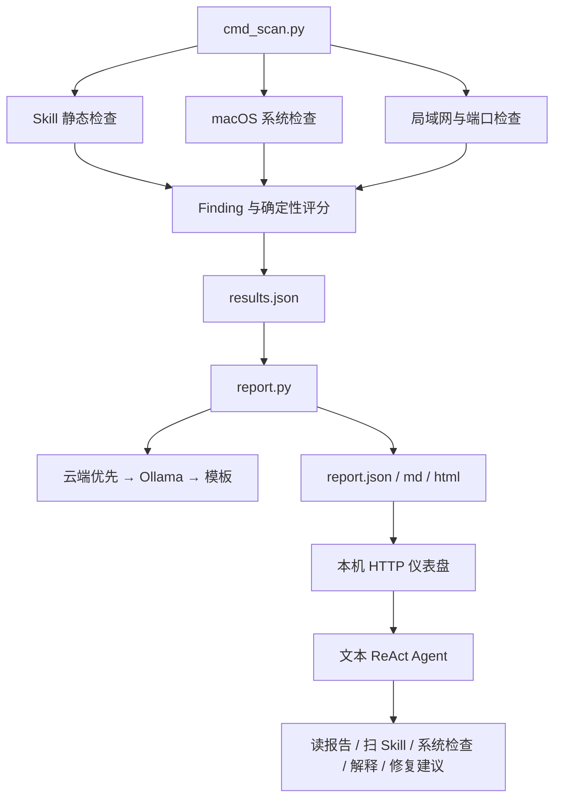

# AgentShield 项目研读与现状核验

> 后续更新：已修复设置接口回传原始密钥、空白保存覆盖密钥及配置文件权限问题；已接通私有模型并新增规则演练，详见 [实现说明](public-wifi-arena-2026-09-24.md)。以下保留初始研读快照。

研读日期：2026-09-24。范围：当前目录内的说明、规格、全部核心 Python 模块、测试脚本、评测定义和三个样本。本文以代码及本次离线复核为依据；未联网核实比赛日期、评分标准或框架映射，未运行云模型、真实局域网扫描或样本脚本。业务代码与原有报告保持不变。

## 1. 项目定位与结论

AgentShield 是面向非技术用户的安全评估原型，覆盖两个对象：第三方 Agent Skill 的静态风险，以及本机系统和局域网环境。核心设计是**确定性规则产生发现与评分，模型负责解释和工具选择**。

目前已形成“Skill 静态扫描 → 统一 Finding → 规则评分 → JSON/Markdown/HTML 报告”的可运行路径，并有网页和文本 ReAct 对话入口。适合继续作为比赛演示原型推进，但尚不足以证明完整安全评估、攻击复现或修复有效性。

最需要补齐的是：环境扫描正确性、结果与证据一致性、可执行评测，以及动态验证和修复复测。继续增加界面功能的优先级应低于这些事项。

## 2. 目录和阅读顺序

| 路径 | 实际职责 | 研读要点 |
|---|---|---|
| `README.md`、`BENCHMARK.md` | 项目定位、启动方式、指标声明 | 部分数字与描述需要更新，不能直接当验收证据 |
| `01_specs/` | 初版架构、内部参赛验收清单 | 初版架构已经落后于实现；权重明确属于内部推算 |
| `02_scan/findings.py` | Finding 数据类、风险分级、报告扣分 | 先读这里，了解每份报告的契约 |
| `05_skill_eval/skillcheck.py` | 遍历 Skill 文件，执行正则及启发式规则 | 决定能发现什么以及哪些场景会漏报 |
| `02_scan/cmd_scan.py` | 统一 CLI，合并 Skill/系统/网络发现 | 当前推荐扫描入口 |
| `02_scan/scanner.py`、`systemcheck.py` | 网络发现、端口扫描、macOS 体检 | 存在已复现的解析与范围问题 |
| `03_ai/report.py` | 叙述生成、分数重算、三格式导出、历史记录 | CLI 报告有模板降级 |
| `03_ai/llm.py` | 云端/Ollama 请求与流式输出 | 云端优先；与 report.py 有重复客户端逻辑 |
| `03_ai/agent.py` | 最多六步的文本 ReAct、工具分发 | 不是动态沙箱执行器 |
| `04_web/app.py` | 标准库 HTTP 服务、页面、JS、SSE、设置和会话 | 单文件 780 行，未使用 Flask |
| `06_samples/` | vulnerable / hardened / benign 样本 | 是静态对照材料，不等于修复闭环 |
| `07_evals/`、`tests/` | 30 条用例描述、预期规则映射、静态门禁和在线冒烟 | 尚无逐条执行 30 条用例的 runner |
| `reports/`、`logs/` | 历史输出 | `.gitignore` 忽略这些目录；复现证据打包时要单独纳入 |

当前目录没有 Git 仓库，`git rev-parse --show-toplevel` 返回失败；也没有依赖清单或 Python 包配置。现有 `.venv` 可运行静态流程，但还没有从干净环境安装的可复现说明。

## 3. 实际架构与数据流



- 网页只监听 `127.0.0.1:8787`，但模型请求可以出网；“本机运行”不等于数据完全不离开设备。
- 网页“体检本机”走扫描子进程及报告子进程；默认报告会尝试云端模型。
- Agent 的 `scan_skill` 直接返回评估摘要，不保存一份完整报告；`run_fix` 返回知识库步骤，不应用补丁。
- 对话历史只保存用户消息和简略完成占位，尚未保存真实回答及完整工具轨迹作为长期对话上下文。
- report.py 可以彻底跳过模型并使用模板；对话 Agent 的两个模型后端都失败时会报错。因此“离线核心扫描可用”和“离线对话可用”要分别表述。
- 系统检查依赖 macOS 命令；当前不能据此宣称 DGX/Linux 环境域可直接运行。Skill 静态层与系统层的可移植性应分开验收。

## 4. 评分与规则如何理解

单条风险原始分：

`impact × exploitability × confidence × exposure`

置信系数为 inferred=0.5、static=0.75、dynamic=1.0；分级阈值为 critical≥20、high≥10、medium≥5、low≥2.5，其余 info。输出中的 `normalized_100` 为原始分除以 25 后乘 100，上限 100。

报告总分从 100 扣除每条 finding 的固定分值：critical 25、high 12、medium 5、low 2、info 0。**总分越高，规则发现的风险越少**；不是攻击成功率，也不代表绝对安全。每条 finding 分别扣分，同一规则命中多处会累计。

代码实际产生八类 Skill 规则：密钥、危险 shell、隐藏 Unicode、网络调用、路径拼接、宽泛触发、缺少文档、缺少许可证。注释中的第九类 `SK-DOMAIN-MISS` 没有实现；`SK-NODOC` 目前只检查 SKILL.md 缺失/为空，没有检查 owner。Unicode 检查也没有覆盖 SKILL.md 本体。

分类字段目前是代码内常量与各规则硬编码；规格引用的 `01_specs/risk_mapping.md` 不存在。尚无来源、版本和逐项映射证据，因此本文不把这些标签视为已经完成官方 OWASP/NIST 对齐。

## 5. 本次已验证结果

运行现有 `tests/run_evals.py`，退出码 0，静态门禁 PASS：预期五类植入规则全部命中，两个对照样本高危发现为 0，高危证据字典非空。

| 样本 | 总分 | 全部发现数 | 分级 | 三次运行 |
|---|---:|---:|---|---|
| vulnerable-skill | 64 | 8 | high 1、medium 4、low 2、info 1 | 完整 finding 内容一致 |
| hardened-skill | 100 | 0 | 无 | 一致 |
| benign-skill | 100 | 0 | 无 | 一致 |

本次静态计时约为 vulnerable 0.001s、hardened 0.001s、benign 小于 0.001s；只是三个很小的本地样本，不能外推到大型 Skill 或端到端模型耗时。

另通过报告函数离线生成了 JSON/Markdown/HTML，模板报告保持 64 分、8 条发现。这个复核没有调用 report.py 的 CLI 历史写入，因此未改动已有 `history.json`。

评测 JSON 实际已有 **30 条**：10 正向、10 对抗、5 负向、5 故障，状态全部为 `planned`。现有门禁不读取 `evals.json`，所以 PASS 不代表这 30 条通过。`BENCHMARK.md` 的“负向 0/5”没有在现有 runner 中逐项验证；动态攻击成功率下降仍未实现。本次补充的三次一致性也仅限上述本地静态样本。

## 6. 已复现问题与修复优先级

以下优先级是项目推进建议；函数复现结果见附件，不代表已做完整渗透测试。

| 优先级 | 位置 | 证据与影响 | 建议 |
|---|---|---|---|
| P1 | `02_scan/scanner.py:164` | 模拟本机 192.168.1.42，生成首个目标是 `168.1.1`，丢失首段；三段地址不能代表预期局域网 | 使用真实接口网络信息与规范 IPv4 地址生成，验证目标边界后再开放 LAN 演示 |
| P1 | `02_scan/scanner.py:124` | 输入开放 445 的 XML，解析 state=null、service 为空，网络规则产生 0 条发现 | 从 state 属性读取；显式检查 service 元素是否为 None |
| P1 | `04_web/app.py:418` | 用假配置调用 GET handler，返回完整 `api_key`；增加 masked 字段没有移除原值 | 后端不返回密钥原文，前端仅展示掩码和设置状态 |
| P1 | `03_ai/report.py:136`、`05_skill_eval/skillcheck.py` | 静态阅读确认密钥匹配行原文进入 evidence，报告叙述又把 evidence 传入模型 | 在保存与出网前统一脱敏，保留位置和可复核的遮盖证据；此次未使用真实密钥做验证 |
| P1 | `03_ai/report.py:250` | 无害 HTML 标记原样保留在导出报告的 summary 中；解释、建议等字段也直接插值 | 所有文本字段统一 HTML 转义；本次只确认输出未转义，未在浏览器执行脚本 |
| P1 | `02_scan/findings.py:85,98` | 无证据的 high 在 JSON 中降为 medium，但总分仍扣 12 得 88；按展示等级应扣 5 得 95 | 用一个有效等级贯穿序列化、聚合和展示，并校验证据结构 |
| P1 | `tests/run_evals.py`、`07_evals/evals.json` | 30 条描述未逐条运行，实际 ghp_、eyJ、SKILL.md Unicode、owner 缺失均未命中预期；本地 requests.post 反而触发网络规则 | 实现独立 fixture、输入/预期/结果记录和失败门禁；更新指标来源 |
| P2 | `02_scan/cmd_scan.py:31` | 改变 fixture.py 内容但路径不变，input_hash 不变 | 哈希覆盖相对路径和文件字节，记录规则版本及运行配置 |
| P2 | `02_scan/systemcheck.py:65` | 模拟 lsof 字段输出存在 8787 监听，解析结果仍为空；解析要求 n 行包含 LISTEN | 按 lsof 字段协议处理，或明确请求状态字段 |
| P2 | `02_scan/systemcheck.py:27` | 模拟命令失败得到 enabled=false，容易将“未知”判为“关闭” | 命令失败返回 unknown/None，保留错误，不生成确定性关闭结论 |
| P2 | `03_ai/agent.py:180` | 无竖线的 Choices 进入 re.split，触发 `NameError: re is not defined` | 补依赖并覆盖选项分隔符与截断响应 |
| P2 | `04_web/app.py:316` | 模拟模型不可用，错误分支对异常做 `e[:80]`，再次触发 TypeError，模板解释不能送达 | 使用 str(e)，测试 SSE 错误与完成事件 |
| P2 | `04_web/app.py:334` | 静态阅读发现路径穿越映射到 curlsh 修复，所有危险 shell 也统一给 curlsh 步骤 | 按具体规则和危险模式返回对应建议 |

进一步需要评估：Agent 读取报告未使用网页层的目录边界校验；网页配置写入没有显式 Origin/Host 校验；关闭会话不会立即取消后台模型请求；报告按目录名字排序而非生成时间；报告 LLM 客户端与共享客户端行为不完全一致。这些是代码阅读发现的设计缺口，本次未进行端到端攻击或在线压力验证。

## 7. 文档与实际能力的差异

| 当前表述/规划 | 实际状态 |
|---|---|
| 初版规格写 Flask、本地模型优先、scan.py | 实际为标准库 HTTPServer、云端优先、cmd_scan.py |
| README 写 25 条骨架 | 实际 30 条描述，全为 planned |
| README 扫描后直接读取 `reports/eval_vulnerable-skill/results.json` | 扫描命令没带 --out 时只输出到终端，不会创建该文件 |
| 静态评估器九类规则 | 实际八类，声明/行为一致性规则缺失 |
| 修复后样本更安全 | 静态分从 64 到 100 已验证；尚无同攻击用例动态复测 |
| 修复按钮/Agent run_fix | 当前仅返回建议，未生成补丁或执行修改 |
| run manifest 可回放 | 只有目录名、文件数和路径列表哈希，缺内容哈希及规则/模型/策略版本 |
| 提交包 | 缺产品级 SKILL.md、skill-card、LICENSE、第三方清单、依赖安装清单、版本标记等 |

项目写的 9/29 截止日期和内部权重仍须由主办方材料确认；本轮仅整理现有项目，不将内部排期提升为官方规则。

## 8. 可复现入口

从项目根目录运行（使用当前已有虚拟环境）：

```bash
# 现有静态门禁，不调用模型、不执行样本
.venv/bin/python tests/run_evals.py

# 研读复核：模拟环境输入，不扫描网络；更新本次研读附件
.venv/bin/python reports/project-review-20260924/verify.py

# 标准 CLI 离线评估示例，显式保存结果
.venv/bin/python 02_scan/cmd_scan.py --skill 06_samples/vulnerable-skill --no-ai --out reports/manual-offline/results.json
.venv/bin/python 03_ai/report.py --input reports/manual-offline/results.json --no-narrative

# 网页入口；体检和解释按钮可能调用配置中的模型
.venv/bin/python 04_web/app.py --open
```

`--no-ai` 当前仅被 CLI 解析，扫描入口本身并不调用 LLM；报告离线的实际开关是 `--no-narrative`。第二条 report CLI 会写报告历史，这是正常运行行为，与本次无历史写入的函数复核不同。

## 9. 后续工作建议

1. 先修复 P1 正确性与数据处理问题，增加针对性的回归验证；同步 README、架构和指标口径。
2. 将 30 条评测描述变成可执行、独立、带预期断言的用例；保存每条结果、失败样本及三次重复运行记录。
3. 完成一个最小动态闭环：隔离环境、合成数据/蜜罐、受控文件和网络轨迹、建议补丁、同用例复测。尚未实现前保持“静态评估原型”的定位。
4. 补安装依赖、平台边界、产品 Skill 包、许可证与第三方清单；最后固化版本、内容哈希、演示素材和提交清单。

## 10. 本次新增附件

- [离线复核数据](../reports/project-review-20260924/verification.json)
- [可重复执行的复核脚本](../reports/project-review-20260924/verify.py)
- [离线报告样例 HTML](../reports/project-review-20260924/offline-sample/report.html)
- [离线报告样例 JSON](../reports/project-review-20260924/offline-sample/report.json)
- [离线报告样例 Markdown](../reports/project-review-20260924/offline-sample/report.md)

附件中的发现用于记录当前行为；复核脚本退出 0 表示完成采集，不表示所有缺陷已经修好。原有静态门禁 PASS 与这些已复现问题可以同时存在。
