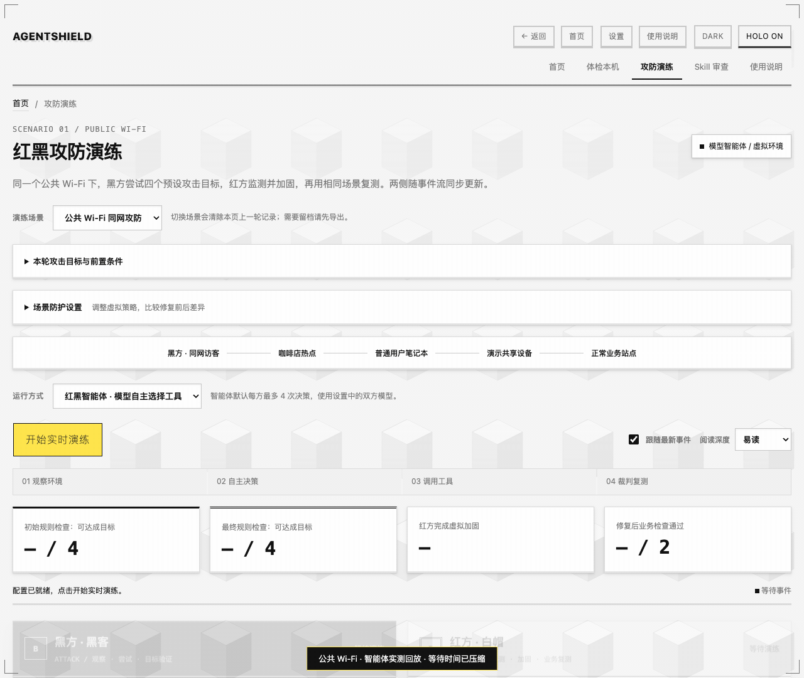

# AgentShield


AgentShield 是一个在本机运行的安全检查工具，可以审查 Agent Skill、检查电脑的安全设置，也可以通过攻防模拟了解不同防护措施的效果。接入模型后，还能用通俗的语言解释发现的问题和修复建议。

[使用说明](使用说明.md) · [HTML 版使用说明](使用说明.html) · [安装与启动](#安装与启动)

## 能做什么

- **检查 Skill**：用本地规则查找风险，也可以安装 NVIDIA SkillSpector 进行补充审查。报告会列出发现的问题、对应证据和检查范围。
- **体检本机**：检查系统安全设置，按需选择局域网探测。本机系统检查目前主要适配 macOS。
- **模拟攻防**：红黑模型各自选择工具，左侧展示黑方尝试，右侧展示红方防护；也可切换为固定流程演示。调整防护策略后，可以比较攻击结果和正常业务是否受到影响。
- **解释结果**：不熟悉安全术语时，可以查看模型生成的说明；需要深入检查时，可以查看规则、证据和原始报告。

攻防演练目前有六个场景：公共 Wi-Fi、恶意 Skill、办公内网横向移动、钓鱼与会话盗用、Web/API 越权和依赖供应链投毒。黑方代表黑客，红方代表白帽。场景使用预设规则和模拟数据，不执行真实攻击。具体用法见 [攻防场景说明](01_specs/extended-arena-2026-09-26.md)。

NVIDIA 审查使用原版 SkillSpector 2.12.0，结果与本地检查分开展示。安装方法见 [NVIDIA 集成说明](09_integrations/nvidia/README.md)，已完成的验证见 [集成验证记录](01_specs/nvidia-integration-2026-09-24.md)。

## 攻防演练展示



公共 Wi-Fi 场景的智能体实测回放，已压缩模型等待时间。左侧是黑方行动，右侧是红方防护；本轮完成 8 次模型决策、1 项虚拟防护变更，最终业务检查 2/2 通过。工具操作的是虚拟环境，不发送真实攻击报文。

## 使用范围与限制

- 检查结果取决于规则和测试用例的覆盖范围。没有发现问题，并不代表不存在风险。
- 攻防演练请使用测试样本，不要接入生产账号或真实密钥；网络检查只用于你拥有或已获授权的设备。
- Skill 静态检查和模板报告可以离线运行，分别使用 `--no-ai` 和 `--no-narrative`；模型分析需要连接相应服务。

## 安装与启动

以下步骤以 macOS 为例。本机系统体检目前主要适配 macOS。主程序使用 Python 标准库，网页、本地规则检查和攻防模拟无需额外安装 Python 依赖，也不需要 DGX Spark。

### 1. 下载项目

先准备 Git 和 Python 3.11，并确认 `python3 --version` 使用的是所需版本。在你希望存放项目的目录运行：

```bash
git clone https://github.com/zhuangjia777/agent-shield.git
cd agent-shield
python3 -m venv .venv
```

已经下载过项目时，直接进入已有的 `agent-shield` 目录即可，无需再次克隆。

### 2. 配置模型

```bash
# 首次: 配置 LLM（复制 config.json.example 改名成 config.json )
test -f config.json || cp config.json.example config.json  # 已有配置不覆盖
```

编辑 `config.json` 中 `cloud` 下的三个字段：

| 字段 | 填写内容 |
| --- | --- |
| `base_url` | 兼容 OpenAI API 的模型接口地址，一般以 `/v1` 结尾 |
| `api_key` | 该接口的访问密钥 |
| `model` | 服务提供的模型名称 |

也可以启动后在网页的“设置”中填写。规则检查和固定流程演示不需要模型；红黑智能体、AI 解释和文字复盘需要连接模型服务。红黑双方默认沿用主模型，也可在设置中各自配置接口、模型及密钥。`config.json` 已被 Git 忽略，不要将密钥写入示例配置。

### 3. 启动网页

在项目目录运行：

```bash
.venv/bin/python 04_web/app.py --open
```

浏览器会打开 [AgentShield](http://127.0.0.1:8787)。使用期间保持终端运行，按 `Ctrl+C` 停止服务。以后启动时，进入项目目录并执行同一条命令即可。

如果 8787 端口已被占用，可以换一个端口：

```bash
.venv/bin/python 04_web/app.py --port 8788 --open
```

### 4. 可选：安装 NVIDIA SkillSpector

需要使用 NVIDIA Skill 安全审查时，再安装这个组件。它使用独立的 Python 环境；以下命令需要先安装 `uv`，并在项目目录执行：

```bash
uv venv --python 3.14 .venv-skillspector
uv pip install --python .venv-skillspector/bin/python \
  -r 09_integrations/nvidia/requirements.lock
.venv/bin/python 09_integrations/nvidia/record_install.py
```

安装过程需要联网下载依赖。最后一条命令会核验组件内容并记录安装路径。安装完成后，打开 [NVIDIA Skill 安全审查](http://127.0.0.1:8787/nvidia)。更多说明见 [集成安装与复现](09_integrations/nvidia/README.md)。

## 命令行使用

以下命令均在项目目录执行：

```bash
# 使用本地规则评估一个 Skill，无需模型
.venv/bin/python 02_scan/cmd_scan.py --skill 06_samples/vulnerable-skill --no-ai

# 生成 JSON、Markdown 和 HTML 报告，使用已配置的模型生成文字说明
.venv/bin/python 03_ai/report.py --input reports/eval_vulnerable-skill/results.json

# 离线生成报告，使用模板说明
.venv/bin/python 03_ai/report.py --input reports/eval_vulnerable-skill/results.json --no-narrative

# 运行基准评测
.venv/bin/python tests/run_evals.py
```

## 如何看报告

本地健康分从 100 分开始，发现问题后按严重程度扣分：严重问题每项扣 25 分，高危扣 12 分，中危扣 5 分，低危扣 2 分，最低为 0 分。分数由规则计算，模型负责解释，不修改这个分数。

每项问题的风险值按以下公式计算，再按阈值划分严重程度：

```text
风险值 = 影响程度 × 可利用性 × 证据可信度 × 暴露程度
```

其中，影响程度和可利用性取值为 1–5，可利用性越高表示越容易被利用；证据可信度取值为 0.5、0.75 或 1.0，暴露程度取值为 0.5、1.0 或 1.5。具体计算见 [findings.py](02_scan/findings.py)。

NVIDIA SkillSpector 的风险分越高，表示风险越大，与本地健康分的方向相反。启用模型分析时，它的结果可能影响 NVIDIA 风险分；两种分数不相加。

## 测试情况

目前本地规则在三个示例 Skill 上命中了预期的 5 项检查，正常样本和加固样本均未出现高危误报。这组结果只覆盖这些样本，不代表已完成全部 30 条评测用例。详细结果见 [BENCHMARK.md](BENCHMARK.md)。NVIDIA 引擎的检查范围和耗时单独记录在 [集成验证记录](01_specs/nvidia-integration-2026-09-24.md) 中。

## 智能体与 NVIDIA 集成

攻防页面默认使用红黑智能体：双方有独立上下文，模型根据观察选择工具，收到结果后继续行动。黑方可观察和尝试目标，红方可查看告警、启用防护并检查业务。每方最多 4 次决策；工具只改变虚拟场景，裁判由规则实现。也可切回不需要模型的固定流程演示。

- **来源验签**已接入 Skill 审查：使用官方 OMS 验签器和锁定的 NVIDIA 信任证书，分开展示未签名、失败和通过。通过验签仍需安全检查。
- **OpenShell 执行适配器**已提供限定工具、严格文件/网络策略及操作日志。真实隔离运行需要可用网关，当前尚未完成网关实测。
- **SkillEvaluator Tier 3**已接入官方工具和四组有无 Skill 对照任务。数据格式校验通过，效果结论须以两组完整实验结果为准；运行失败不生成提升分数。

安装、运行与结果位置见 [集成使用说明](09_integrations/README.md)。DGX Spark 实机迁移仍待完成；当前可使用已有私有模型接口。

## 项目目录

```text
01_specs/        架构设计、功能方案和验证记录
02_scan/         扫描入口、系统与网络检查、评分规则
03_ai/           模型调用、结果解释和报告生成
04_web/          本机网页界面
05_skill_eval/   Skill 检查规则及 NVIDIA 扫描入口
06_samples/      漏洞、加固和正常三个示例 Skill
07_evals/        评测用例和预期结果
08_arena/        六种攻防模拟场景
09_integrations/ NVIDIA 组件版本、依赖和运行适配
10_skills/       AgentShield 审计 Skill 草稿，尚未完成效果对照测试
docs/assets/    README 封面等文档图片
reports/        本地生成的报告，不上传到 Git
tests/          自动化检查与评测脚本
config.json     模型接口、密钥及 Ollama 配置，不上传到 Git
BENCHMARK.md    测试结果和待完成的评测项
```
