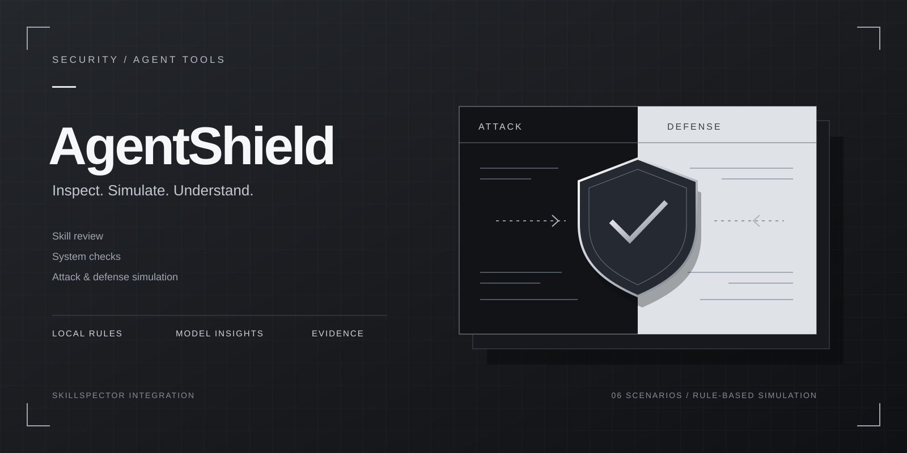
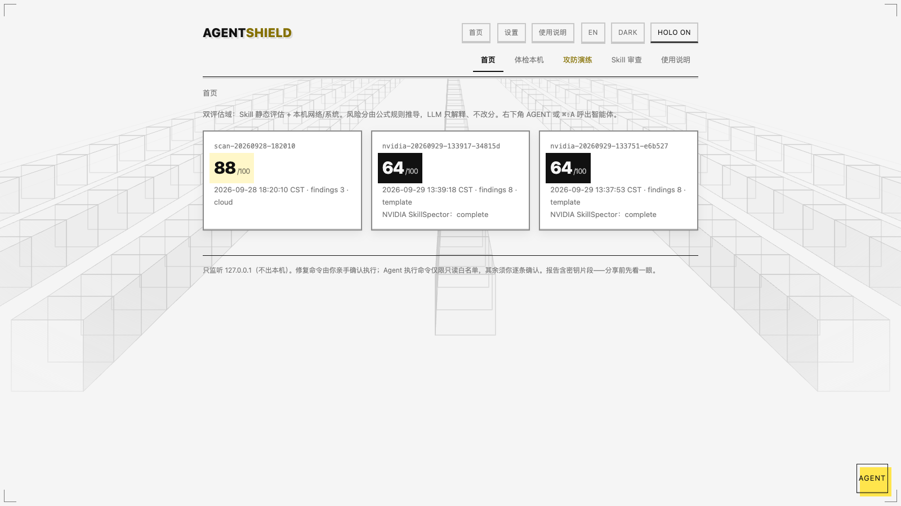
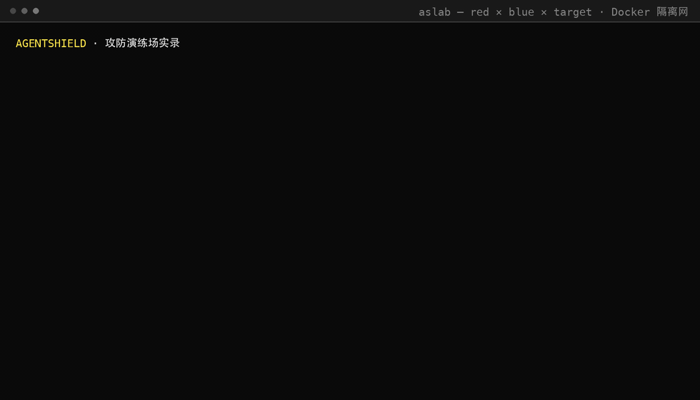
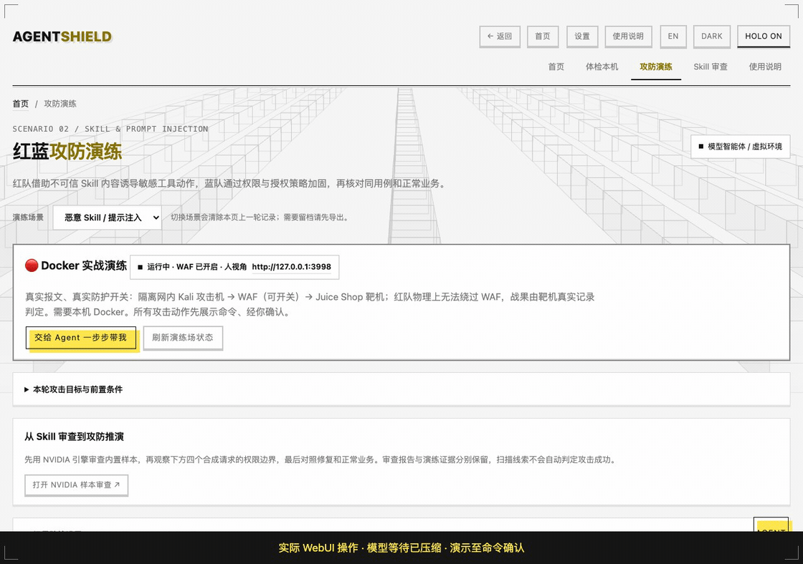
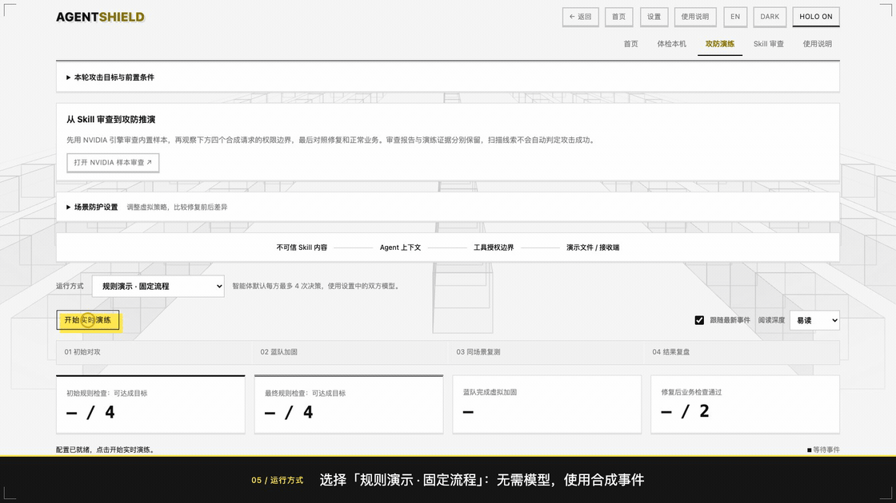

# AgentShield

[English](README.md) | **简体中文**



**一个会自己动手攻击的 AI 安全智能体。** 先在本机做隐私/漏洞体检评分，再把攻防对抗搬进 Docker 隔离网真打一遍：Kali 攻击机发出真实报文，WAF 真拦真放，战果由靶机自己的记录说话。全程本地运行，MIT 开源。

## 视频：红蓝实战与 Agent 设计

https://github.com/user-attachments/assets/7d859898-fcee-42a4-bb74-403a42390e1d

**[下载视频（2 分 42 秒，中文配音＋字幕）](docs/assets/agent-shield-live-agent-v2.mp4)** · [字幕文件](docs/assets/agent-shield-live-agent-v2.zh-CN.srt)

以已有 Docker 实测回放为主线：同一条攻击在 WAF 开启时被拦截，关闭防护后命中，恢复防护后再次被拦截。视频介绍 ReAct 工具决策、人工确认、隔离校验和靶机独立裁判。当前实战由一个 Agent 编排红队工具与蓝队 WAF。

## WebUI 界面



## Docker 红蓝实战演练



上面这段是 AgentShield 实战演练的一次真实运行记录（压缩了模型思考等待）：红队容器用 SQL 注入打管理员登录，WAF 开启时 403 拦下、正常业务不受影响；蓝队误关 WAF 后**同一发 payload** 拿到管理员登录凭证；裁判直接读靶机 API 确认 `loginAdminChallenge` 达成——不听模型自评。结束后一键销毁全部容器，命令与输出全程落盘。

## 交给 Agent 一步步带我



从 Docker 实战入口发起的实际操作：Agent 检查已有演练场、提出命令，收到 `need_confirm` 后展示完整命令并等待用户确认或取消。录制停在确认处，本次录制未执行攻击；模型等待时间已缩短。

## 攻防演练 WebUI：对攻、加固与复测



此动图展示**固定流程规则沙盘**的红蓝事件流与前后指标，使用合成事件，不发送真实攻击报文；上方 Docker 实战动图展示真实执行。

[使用说明](使用说明.md) · [HTML 版使用说明](使用说明.html) · [安装与启动](#安装与启动)

## 能做什么

- **实战演练（真实攻防）**：Docker 隔离网内起一座演练场——Kali 容器当红队、可开关的 WAF 当蓝队、OWASP Juice Shop 当靶机。智能体一步步带你打：每个攻击动作先展示完整命令、经你确认才执行；蓝队开/关防护后红队复测同一发攻击，攻防效果当场对比。详见[实战演练](#实战演练需要本机-docker)。
- **体检本机**：检查系统安全设置，按需选择局域网探测，给出 0–100 健康分和逐项修复建议。本机系统检查目前主要适配 macOS。
- **检查 Skill**：用本地规则查找 Agent Skill 的安全风险，也可以安装 NVIDIA SkillSpector 进行补充审查。报告会列出发现的问题、对应证据和检查范围。
- **沙盘推演**：规则模式不需要 Docker 和模型；智能体模式需要模型。十个攻防场景（公共 Wi-Fi、恶意 Skill、内网横向移动、钓鱼与会话盗用、Web/API 越权、供应链投毒、AI 智能体注入、访客设备与办公装置、云配置密钥与存储桶、运维智能体横幅策反），红蓝模型各自决策，工具只改变虚拟场景，不发送真实报文。调整防护策略后可以对比攻击结果和正常业务是否受影响，详见[攻防场景说明](01_specs/extended-arena-2026-09-26.md)与[演练场剧本说明](01_specs/live-drill-scenarios-2026-09-29.md)。
- **智能体对话**：右下角 AGENT 呼出，ReAct 循环逐步执行：读报告、查本机、跑命令（只读白名单直跑，其余逐条找你确认）、起演练场、删报告（确认闸）。
- **解释结果**：不熟悉安全术语时，可以查看模型生成的说明；需要深入检查时，可以查看规则、证据和原始报告。

NVIDIA 审查使用原版 SkillSpector 2.12.0，结果与本地检查分开展示。安装方法见 [NVIDIA 集成说明](09_integrations/nvidia/README.md)，已完成的验证见 [集成验证记录](01_specs/nvidia-integration-2026-09-24.md)。

## 实战演练（需要本机 Docker）

现有攻防演练是沙盘推演。「实战演练」把对抗搬进 Docker 隔离网络，让红队真的打出报文、蓝队真的改防护配置——入口在攻防演练页的「🔴 Docker 实战演练」卡片，点「交给 Agent 一步步带我」由智能体引导：

- **环境**：需要 Docker（不需要安装 Kali 系统，攻击机用 Kali 官方 arm64 容器镜像）。红队容器 + 内置漏洞靶机（OWASP Juice Shop）跑在一个禁止出网的内部网络里，攻击打不到你的路由器和互联网。
- **打法**：红队模型调用容器内的真实工具（nmap/sqlmap/curl 等），每个攻击动作先展示完整命令、经你确认才执行；蓝队的防护动作是开启/关闭靶机前的 WAF（红队在网络拓扑上无法绕过 WAF 直打靶机）；战果由 HTTP 探针实测判定，不靠模型自评。演练结束后现场默认保留，可以继续看日志、复测，确认完再一键销毁全部容器；命令与输出全程落盘。
- **命名剧本**：三条一键演示剧本，判定全部有客观依据——SQL 注入会话劫持（`sqli_session`）、XSS 编码绕过 WAF（`xss_encoded_bypass`）、越权枚举用户（`bac_enumeration`）。演练场卡片里的「快速剧本」下拉（或命令行 `livelab.py run <剧本>`）会自动打一遍、切 WAF、复测、按靶机自身记录裁决，结束后把 WAF 恢复为拦截。详见[演练场剧本说明](01_specs/live-drill-scenarios-2026-09-29.md)。
- **边界**：只覆盖网络和 Web 应用层。Wi-Fi 射频类场景（中间人、deauth）做不了——Apple Silicon 内置网卡不支持 monitor mode，需要外置 USB 网卡加完整 Kali 虚拟机，属于后续可选项。靶机自带真实漏洞，只能在隔离网络内使用，绝不能暴露到可达网络；红队弹药仅对隔离网内目标放行，隔离失效时宁可拒绝启动。
- **合法性**：演练对象仅限本机容器内的靶机。对任何不属于你或未获书面授权的系统发起测试都是违法行为，本项目不提供也不协助此类能力。

### 当前界面怎么用

1. 启动本机 Docker，在“设置”中配置并测试模型连接，然后打开“攻防演练”。
2. 在统一的“演练场景”列表中选择场景；**SQL 注入、XSS 编码绕过的 Docker 实战入口排在最前面**。
3. 点击 **“交给 Agent 一步步带我”**。Agent 检查或启动演练场，根据工具反馈逐步规划；查看完整命令后，选择“确认执行”或“取消”，也可输入自己的回答。
4. 用“刷新演练场状态”检查容器与 WAF，用“停止并清理演练场”结束演练。关闭网页不会停止容器。

| 演练场景 | Docker 实战对应范围 |
| --- | --- |
| SQL 注入 · 会话劫持 | 对比 WAF 开关前后的登录请求结果 |
| XSS 编码绕过 · WAF 盲区 | 对比字面标签与编码内容的过滤结果；请求通过不等于浏览器已执行 XSS |
| Web / API 越权访问 | 跨用户枚举子场景；其他用例仍为合成推演 |
| AI 智能体注入、恶意 Skill 等其他场景 | 当前仅支持合成推演，Docker 引导按钮禁用并说明原因 |

页面只保留一个 Agent 引导入口；固定剧本运行入口已移除，后台剧本用于复现与回归验证。合成沙盘的规则演示无需模型，Agent 引导和红蓝模型决策需要模型服务。

确认问题缺少模型选项时，界面补充“确认执行 / 取消”，开放问题提供输入框和提交按钮。Ask 参数无法解析时会停止本轮，不会以反复重试替代用户确认。升级代码并重启 WebUI 后，需要刷新页面并开始新会话；原对话不会跨服务重启恢复。已有视频和 GIF 是此前版本的运行记录，按钮布局以当前界面为准。

## 使用范围与限制

- 检查结果取决于规则和测试用例的覆盖范围。没有发现问题，并不代表不存在风险。
- 攻防演练请使用测试样本，不要接入生产账号或真实密钥；网络检查只用于你拥有或已获授权的设备。
- Skill 静态检查和模板报告可以离线运行，分别使用 `--no-ai` 和 `--no-narrative`；模型分析需要连接相应服务。

## 安装与启动

以下步骤以 macOS 为例。本机系统体检目前主要适配 macOS。主程序使用 Python 标准库，网页、本地规则检查和攻防模拟无需额外安装 Python 依赖，也不需要 DGX Spark。

### 1. 下载项目

先准备 Git 和 Python 3.11，并确认 `python3 --version` 使用的是所需版本。在你希望存放项目的目录运行：

```bash
git clone https://github.com/zhuangjia777/agent-shield.git
cd agent-shield
python3 -m venv .venv
```

已经下载过项目时，直接进入已有的 `agent-shield` 目录即可，无需再次克隆。

### 2. 配置模型

```bash
# 首次: 配置 LLM（复制 config.json.example 改名成 config.json )
test -f config.json || cp config.json.example config.json  # 已有配置不覆盖
```

编辑 `config.json` 中 `cloud` 下的三个字段：

| 字段 | 填写内容 |
| --- | --- |
| `base_url` | 兼容 OpenAI API 的模型接口地址，一般以 `/v1` 结尾 |
| `api_key` | 该接口的访问密钥 |
| `model` | 服务提供的模型名称 |

也可以启动后在网页的“设置”中填写。规则检查和固定流程演示不需要模型；红蓝智能体、AI 解释和文字复盘需要连接模型服务。红蓝双方默认沿用主模型，也可在设置中各自配置接口、模型及密钥。`config.json` 已被 Git 忽略，不要将密钥写入示例配置。

**阶跃星辰 StepFun** 是可选的云端供应商：`base_url` 填 `https://api.stepfun.com/v1`，`model` 填当前在售的 Step 模型 ID（如 `step-3.7-flash`，见 [StepFun 快速开始](https://platform.stepfun.com/docs/zh/quickstart/overview)），密钥在 [StepFun 开放平台接口密钥页](https://platform.stepfun.com/interface-key)创建。

### DGX Spark / 华硕 Ascent GX10 本地模型：Qwen3.8-27B / Qwen3.8-Flash-Next

可让 **DGX Spark 负责模型推理，AgentShield 通过本地兼容 OpenAI 的接口调用**，用于 Agent 引导、红蓝双方决策和报告解释。模型服务与 Docker 演练场是两个独立进程；停止演练不会卸载模型。

[NVIDIA DGX Spark](https://www.nvidia.com/en-us/products/workstations/dgx-spark/) 配备 128 GB 统一内存，系统、模型权重、KV cache 和 Docker 容器共享这部分内存。建议先用 27B 完成接入，再尝试 Flash-Next；一次只加载一个模型。

**平替机型——华硕 ASUS Ascent GX10**：同为 NVIDIA GB10 Grace Blackwell 平台的 OEM 整机——同款 20 核 Arm CPU（10× Cortex-X925 + 10× Cortex-A725）、1 PFLOP FP4 张量性能、128 GB LPDDR5x 统一内存，出厂即 NVIDIA DGX OS（[华硕规格页](https://www.asus.com/networking-iot-servers/desktop-ai-supercomputer/ultra-small-ai-supercomputers/asus-ascent-gx10/techspec/)）。本节所有步骤对 GX10 原样适用，差别只在存储（1 TB / 2 TB / 4 TB 可选）和接口细节。

| 模型 | 本地起步方案 | 选择说明 |
| --- | --- | --- |
| [Qwen3.8-27B](https://huggingface.co/Qwen/Qwen3.8-27B) | [Unsloth GGUF](https://huggingface.co/unsloth/Qwen3.8-27B-GGUF) `UD-Q4_K_M` | 27B 稠密模型，作为首次部署方案，为其他服务留出内存 |
| [Qwen3.8-Flash-Next](https://huggingface.co/Qwen/Qwen3.8-Flash-Next) | [Unsloth GGUF](https://huggingface.co/unsloth/Qwen3.8-Flash-Next-GGUF) `UD-Q3_K_XL`，实验选项 | 125B MoE、激活 6B，另含 51B n-gram embedding 与 4B MTP；不能按“6B 模型”估算内存。该量化文件约 90 GB，加载后的总内存还会增加 |

GGUF 是 Unsloth 发布的第三方量化版本，非 Qwen 原始权重。Flash-Next 的 `UD-Q4_K_XL` 文件约 111 GB，在单台 Spark 上留给系统与运行时的余量很小，因此这里从较低量化和 8K 上下文开始。实际容量、质量与速度需在目标机器确认，模型名称中的 Flash 不等于本项目实测更快。

**1. 在 Spark 上编译 CUDA 版 llama.cpp。** 使用 Spark 自带或已正确配置的 NVIDIA 驱动与 CUDA Toolkit，先确认 `nvidia-smi`、`nvcc --version` 正常。下列命令在 Spark 的 Linux 终端执行；需要联网下载源码和模型。编译方法来自 [llama.cpp 构建文档](https://github.com/ggml-org/llama.cpp/blob/master/docs/build.md)。

```bash
sudo apt-get update
sudo apt-get install -y git cmake build-essential libssl-dev libcurl4-openssl-dev
mkdir -p "$HOME/llm"
cd "$HOME/llm"
git clone https://github.com/ggml-org/llama.cpp.git
cd llama.cpp
cmake -B build -DGGML_CUDA=ON -DCMAKE_BUILD_TYPE=Release
cmake --build build --config Release -j 4 --target llama-server
# 记录版本，便于复现；新模型需要支持其架构的近期版本
git rev-parse HEAD
```

**2. 启动一个模型。** 以下两段二选一；从上面的 `llama.cpp` 目录运行。首次启动自动下载量化权重，等待日志确认加载完成。参数含义见 [llama-server 文档](https://github.com/ggml-org/llama.cpp/tree/master/tools/server)。

```bash
# 方案 A：Qwen3.8-27B
./build/bin/llama-server \
  -hf unsloth/Qwen3.8-27B-GGUF:UD-Q4_K_M \
  --alias agent-shield-local --host 127.0.0.1 --port 8000 \
  --api-key spark-local -ngl 99 -c 16384 -np 1 \
  --jinja --chat-template-kwargs '{"enable_thinking":false}'
```

```bash
# 方案 B：Qwen3.8-Flash-Next（先 Ctrl+C 停止方案 A）
./build/bin/llama-server \
  -hf unsloth/Qwen3.8-Flash-Next-GGUF:UD-Q3_K_XL \
  --alias agent-shield-local --host 127.0.0.1 --port 8000 \
  --api-key spark-local -ngl 99 -c 8192 -np 1 \
  --jinja --chat-template-kwargs '{"enable_thinking":false}'
```

这里使用非思考模式作为接入起点，避免有限的输出额度被思考内容占满；这不是模型能力或最优采样配置的评测。若出现未知模型架构或模板错误，更新到支持该模型的 llama.cpp 版本后重新编译。若内存不足，先缩短上下文或换回 27B；Spark 的 CPU/GPU 共享内存，CPU offload 不会增加机器的物理内存。

**3. 验证接口并接入 AgentShield。** 在另一个 Spark 终端执行：

```bash
curl --fail http://127.0.0.1:8000/v1/models \
  -H 'Authorization: Bearer spark-local'
curl --fail http://127.0.0.1:8000/v1/chat/completions \
  -H 'Authorization: Bearer spark-local' -H 'Content-Type: application/json' \
  -d '{"model":"agent-shield-local","messages":[{"role":"user","content":"请用一句话介绍你自己。"}],"max_tokens":256}'
```

确认返回非空 `choices[0].message.content` 后，在 AgentShield 网页“设置”中填写，或合并以下内容到已有 `config.json` 的 `cloud` 字段（保留其他配置）：

```json
{
  "cloud": {
    "base_url": "http://127.0.0.1:8000/v1",
    "api_key": "spark-local",
    "model": "agent-shield-local",
    "max_tokens": 4096
  }
}
```

`cloud` 是项目里兼容 OpenAI 接口的配置名称，这里的推理仍在 Spark 本地执行。**API key 不要留空**：当前客户端以非空 key 启用该调用路径；示例 key 与上面的服务端参数一致，仅用于回环地址示例。若设置了 `OPENAI_BASE_URL`、`OPENAI_API_KEY`、`OPENAI_MODEL`，它们会覆盖主模型的文件配置。红蓝双方选择“沿用主模型”，共享一个模型服务，但保留各自的对话上下文。

如果 AgentShield 运行在你的 Mac/PC，模型运行在 Spark，在 Mac/PC 上保持以下 SSH 隧道运行（替换用户名和主机名）：

```bash
ssh -N -L 8000:127.0.0.1:8000 spark-user@spark-host
```

AgentShield 仍填写 `http://127.0.0.1:8000/v1`，不需要把模型端口开放到公网。按前面的快速开始启动 AgentShield，再依次测试设置中的模型连接、Agent 问答和红蓝演练。Spark 只提供远程推理时，系统体检及 Docker 工具仍在运行 AgentShield 的那台主机执行；本机体检目前主要适配 macOS。

退出：模型终端 `Ctrl+C` 释放模型占用；SSH 隧道终端 `Ctrl+C` 关闭转发；Docker 演练使用页面的“停止并清理演练场”。实机验收时记录 llama.cpp commit、量化文件版本、上下文长度、首字延迟、生成速度及峰值内存。

### 3. 启动网页

在项目目录运行：

```bash
.venv/bin/python 04_web/app.py --open
```

浏览器会打开 [AgentShield](http://127.0.0.1:8787)。使用期间保持终端运行，按 `Ctrl+C` 停止服务。以后启动时，进入项目目录并执行同一条命令即可。

如果 8787 端口已被占用，可以换一个端口：

```bash
.venv/bin/python 04_web/app.py --port 8788 --open
```

#### 关闭程序

在启动程序的终端按 **Control + C（Ctrl+C）** 即可停止服务。只关闭浏览器页面不会退出程序。

如果找不到启动时的终端，可先查看哪个进程在使用默认端口：

```bash
lsof -nP -iTCP:8787 -sTCP:LISTEN
```

确认是 AgentShield 服务后，执行：

```bash
lsof -tiTCP:8787 -sTCP:LISTEN | xargs kill
```

如果启动时指定了其他端口，将上面命令中的 `8787` 换成对应端口。下次使用时重新运行启动命令即可。

### 4. 可选：安装 NVIDIA SkillSpector

需要使用 NVIDIA Skill 安全审查时，再安装这个组件。它使用独立的 Python 环境；以下命令需要先安装 `uv`，并在项目目录执行：

```bash
uv venv --python 3.14 .venv-skillspector
uv pip install --python .venv-skillspector/bin/python \
  -r 09_integrations/nvidia/requirements.lock
.venv/bin/python 09_integrations/nvidia/record_install.py
```

安装过程需要联网下载依赖。最后一条命令会核验组件内容并记录安装路径。安装完成后，打开 [NVIDIA Skill 安全审查](http://127.0.0.1:8787/nvidia)。更多说明见 [集成安装与复现](09_integrations/nvidia/README.md)。

## 命令行使用

以下命令均在项目目录执行：

```bash
# 使用本地规则评估一个 Skill，无需模型
.venv/bin/python 02_scan/cmd_scan.py --skill 06_samples/vulnerable-skill --no-ai

# 生成 JSON、Markdown 和 HTML 报告，使用已配置的模型生成文字说明
.venv/bin/python 03_ai/report.py --input reports/eval_vulnerable-skill/results.json

# 离线生成报告，使用模板说明
.venv/bin/python 03_ai/report.py --input reports/eval_vulnerable-skill/results.json --no-narrative

# 运行基准评测
.venv/bin/python tests/run_evals.py
```

实战演练也可以不经网页，直接用控制脚本起停：

```bash
.venv/bin/python 08_arena/livelab.py start   # 起场（自动做网络隔离校验）
.venv/bin/python 08_arena/livelab.py status  # 容器与 WAF 状态
.venv/bin/python 08_arena/livelab.py scenario            # 列出命名剧本
.venv/bin/python 08_arena/livelab.py run sqli_session    # 演示并裁决一条剧本
.venv/bin/python 08_arena/livelab.py stop    # 一键销毁
```

### 查看 Docker 控制台与日志

在 WebUI 的 Docker 实战卡片下展开 **“实时控制台”**，可切换 WAF、靶机和 Agent 攻击命令输出。每 2 秒刷新，支持暂停、自动滚动和复制；折叠或切到后台时停止轮询。该面板只读，攻击输出在命令完成后显示，历史记录可能截断。

先启动演练场，再在宿主机终端执行 `docker ps`，确认以下容器正在运行：

| 容器 | 用途 |
| --- | --- |
| `aslab-red` | Kali 攻击机 |
| `aslab-blue` | WAF 防护 |
| `aslab-target` | OWASP Juice Shop 靶机 |

进入 Kali 容器的交互终端：

```bash
docker exec -it aslab-red bash
```

查看 WAF 或靶机最近 100 行日志，并持续跟踪新日志（分别在不同终端运行）：

```bash
docker logs -f --tail 100 aslab-blue
docker logs -f --tail 100 aslab-target
```

使用 Docker Desktop 时，在 **Containers** 中选择对应容器，打开 **Exec** 进入终端，或打开 **Logs** 查看日志。

`docker exec` 打开的是新的 shell，不会回放 Agent 之前执行的命令；Agent 的攻击命令与输出记录见项目目录下的 `logs/arena_live/events.jsonl`。容器日志主要显示服务输出。

输入 `exit` 退出容器终端；查看日志时按 `Ctrl+C` 退出跟踪。这两种操作都不会停止容器。若提示容器不存在或未运行，请先启动演练场；结束演练请使用页面的“停止并清理演练场”。

## 如何看报告

本地健康分从 100 分开始，发现问题后按严重程度扣分：严重问题每项扣 25 分，高危扣 12 分，中危扣 5 分，低危扣 2 分，最低为 0 分。分数由规则计算，模型负责解释，不修改这个分数。

每项问题的风险值按以下公式计算，再按阈值划分严重程度：

```text
风险值 = 影响程度 × 可利用性 × 证据可信度 × 暴露程度
```

其中，影响程度和可利用性取值为 1–5，可利用性越高表示越容易被利用；证据可信度取值为 0.5、0.75 或 1.0，暴露程度取值为 0.5、1.0 或 1.5。具体计算见 [findings.py](02_scan/findings.py)。

NVIDIA SkillSpector 的风险分越高，表示风险越大，与本地健康分的方向相反。启用模型分析时，它的结果可能影响 NVIDIA 风险分；两种分数不相加。

## 测试情况

目前本地规则在四个示例 Skill 上命中了预期检查（植入漏洞样本 5 项；运维 Agent 样本含指令注入面、明文密钥、eval 执行、供应链管道 4 项），正常样本和加固样本均未出现高危误报。这组结果只覆盖这些样本，不代表已完成全部 30 条评测用例。详细结果见 [BENCHMARK.md](BENCHMARK.md)。NVIDIA 引擎的检查范围和耗时单独记录在 [集成验证记录](01_specs/nvidia-integration-2026-09-24.md) 中。

## 智能体与 NVIDIA 集成

攻防页面默认使用红蓝智能体：双方有独立上下文，模型根据观察选择工具，收到结果后继续行动。红队可观察和尝试目标，蓝队可查看告警、启用防护并检查业务。每方最多 4 次决策；工具只改变虚拟场景，裁判由规则实现。也可切回不需要模型的固定流程演示。

- **来源验签**已接入 Skill 审查：使用官方 OMS 验签器和锁定的 NVIDIA 信任证书，分开展示未签名、失败和通过。通过验签仍需安全检查。
- **OpenShell 执行适配器**已提供限定工具、严格文件/网络策略及操作日志。真实隔离运行需要可用网关，当前尚未完成网关实测。
- **SkillEvaluator Tier 3**已接入官方工具和四组有无 Skill 对照任务。数据格式校验通过，效果结论须以两组完整实验结果为准；运行失败不生成提升分数。

安装、运行与结果位置见 [集成使用说明](09_integrations/README.md)。

## 下一步计划

按大致优先级排列：

1. **规则推演新场景**——RAG 知识库污染、容器权限边界，沿用现有声明式场景框架扩展。
2. **实战演练新剧本**——在现有三条命名剧本之外，增加 nmap 侦察线和 sqlmap 自动化线的一键剧本。
3. **OpenShell 网关实测**——完成隔离执行网关，让 Skill 动态审查跑在真实沙箱上。
4. **自适应展示**——自动识别用户专业程度，替代目前的手动深度切换。

## 项目目录

```text
01_specs/        架构设计、功能方案和验证记录
02_scan/         扫描入口、系统与网络检查、评分规则
03_ai/           模型调用、结果解释和报告生成
04_web/          本机网页界面
05_skill_eval/   Skill 检查规则及 NVIDIA 扫描入口
06_samples/      漏洞、运维 Agent、加固和正常四个示例 Skill
07_evals/        评测用例和预期结果
08_arena/        沙盘推演场景 + 实战演练控制（livelab.py、waf.py）
09_integrations/ NVIDIA 组件版本、依赖和运行适配
10_skills/       AgentShield 审计 Skill 草稿，尚未完成效果对照测试
docs/assets/    README 封面等文档图片
reports/        本地生成的报告，不上传到 Git
tests/          自动化检查与评测脚本
config.json     模型接口、密钥及 Ollama 配置，不上传到 Git
BENCHMARK.md    测试结果和待完成的评测项
```

## License

MIT，见 [LICENSE](LICENSE)。
